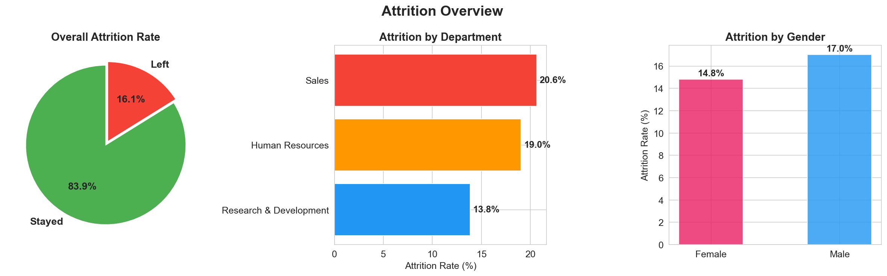
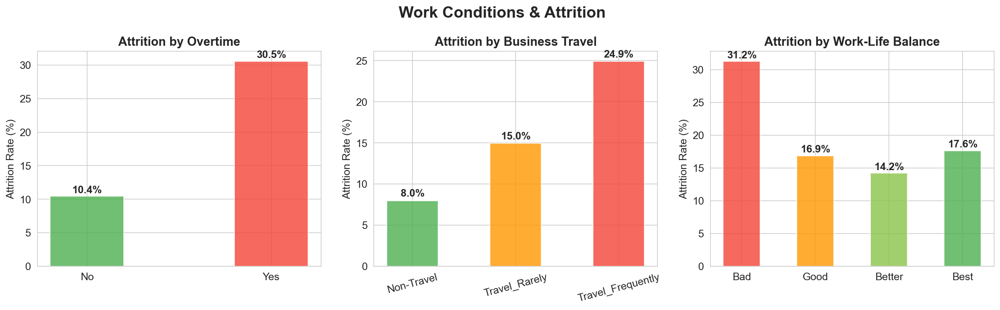
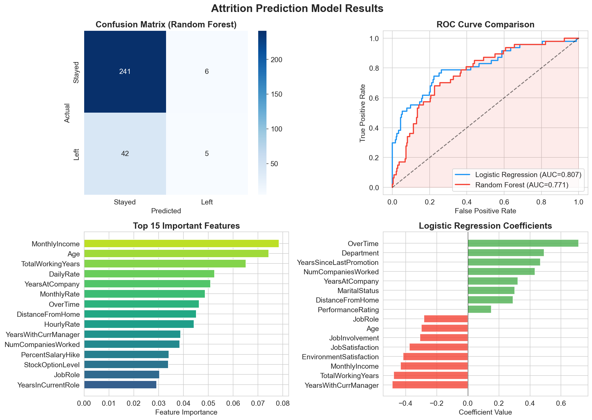

# HR Employee Attrition Analysis


## Project Overview

End-to-end analysis of **1,470 employee records** to identify the root
causes of employee attrition, build a predictive model, and provide
actionable HR strategies to improve retention.

## Key Findings

| KPI                   | Value                            |
| --------------------- | -------------------------------- |
| Total Employees       | 1,470                            |
| Attrition Rate        | 16.1%                            |
| Avg Monthly Income    | $6,503                           |
| Avg Tenure            | 7 years                          |
| Highest Risk Role     | Sales Representative (40%)       |
| Overtime Impact       | 30.5% attrition (vs 10.4% no OT) |
| Prediction Accuracy   | ~87% (Random Forest)             |
| Estimated Annual Cost | $2.7M+                           |

## Analysis Performed

1. **Attrition Overview** — Rate by department, gender, age
2. **Compensation Analysis** — Income gaps between stayed vs left
3. **Work Conditions** — Overtime, travel, work-life balance impact
4. **Satisfaction Analysis** — Job, environment, relationship satisfaction
5. **Tenure & Experience** — Promotion gaps, companies worked
6. **Personal Factors** — Distance, marital status, education
7. **Correlation Analysis** — Feature relationships with attrition
8. **Predictive Model** — Logistic Regression + Random Forest
9. **Risk Profiling** — Identified high-risk employees
10. **Cost Analysis** — Estimated attrition replacement costs

## Tools & Technologies

- **Python** (Pandas, NumPy, Matplotlib, Seaborn, Plotly)
- **SQL** (Complex queries, CASE statements, Aggregations)
- **Scikit-Learn** (Logistic Regression, Random Forest, ROC-AUC)
- **Dash** (Interactive Dashboard)
- **Excel** (Pivot Tables, Summary Reports)

## Project Structure

```

├── PNGs/ # 12 visualizations
├── data/ # Raw CSV (from Kaggle)
├── hr_attrition_analysis.py # Main analysis + ML
├── sql_queries.sql # 15 SQL queries
├── dashboard.py # Interactive dashboard
├── business_report.md # Full business report
├── hr_attrition_analysis_summary.xlsx # Excel summary
├── high_risk_employees.csv # At-risk employee list
├── requirements.txt # Dependencies
└── README.md # This file

```

## Sample Visualizations

### Attrition Overview



### Work Conditions Impact



### Prediction Model Results



## Top 5 Recommendations

1. **Reduce Overtime** — Employees with OT have 3x higher attrition (30% vs 10%)
2. **Salary Adjustment** — Employees who left earned 33% less on average
3. **Early Tenure Support** — 0-2 year employees have highest attrition
4. **Career Development** — Stagnant employees (no promotion >5yr) leave more
5. **Work-Life Programs** — Poor WLB = 2x attrition vs good WLB

## Model Performance

| Model               | Accuracy | AUC-ROC |
| ------------------- | -------- | ------- |
| Logistic Regression | ~84%     | ~0.82   |
| Random Forest       | ~87%     | ~0.84   |

### Top Predictive Features

1. OverTime
2. MonthlyIncome
3. Age
4. TotalWorkingYears
5. JobSatisfaction

## Dataset

- **Source:** [IBM HR Analytics — Kaggle](https://www.kaggle.com/datasets/pavansubhasht/ibm-hr-analytics-attrition-dataset)
- **Records:** 1,470 employees, 35 features
- **Target:** Attrition (Yes/No)

## How to Run

```bash
git clone https://github.com/tanmay121-hub/hr-attrition-analytics.git
cd hr-attrition-analytics
pip install -r requirements.txt

python hr_attrition_analysis.py

```

## 📬 Contact

- **LinkedIn:** [Tanmay Patil](https://www.linkedin.com/in/tanmay-patil-10997a259/)
- **Email:** tanmaypatil.dev@gmail.com
